<div align="center">


<h1>Service Principal Lifecycle Management Platform</h1>

<p><strong>The Strategic Governance Control Plane for Provisioning, Rotating, and Retiring Cloud Identities at Enterprise Scale</strong></p>

[]()
[]()
[]()

<br/>

> **"Identity is the new perimeter."** 
> Service Principal Lifecycle (Identity-Ops) is an enterprise-grade platform designed to provide a secure, measurable, and highly automated foundation for global service identity governance. It orchestrates the complex lifecycle of cloud service principals—from standardized provisioning and least-privilege assignment to automated credential rotation and risk-based decommissioning. By providing a centralized identity hub with real-time risk scoring, rotation scheduling, and immutable audit logs, it enables organizations to eliminate identity sprawl, reduce the risk of credential exposure, and ensure consistent architectural excellence across every tier of the global infrastructure.

</div>

---

## 🏛️ Executive Summary

Modern cloud architectures rely on thousands of non-human identities. Organizations fail to maintain security not because of a lack of credentials, but because of fragmented identity lifecycles, unmanaged credential rotation, and an inability to track where and how service principals are being used across the enterprise.

This platform provides the **Identity Governance Plane**. It implements a complete **Identity Intelligence Framework**—from automated principal provisioning and credential management to a specialized risk scoring engine and decommissioning workflow. By operationalizing service principal lifecycles, it ensures that your identities are not just created, but continuously secured, rotated for compliance, and governed with strategic precision.

---

## 🏛️ Core Identity Pillars

1. **Automated Provisioning Engine**: Centralized hub for creating service principals with standardized naming, tagging, and project isolation.
2. **Dynamic Credential Rotation**: Automated lifecycle management for client secrets and certificates, reducing the window of opportunity for exposed credentials.
3. **Least-Privilege Enforcement**: Policy-driven assessment of permissions to ensure service principals only have the access required for their function.
4. **Identity Risk Scoring**: Continuous evaluation of principal risk based on permission breadth, credential age, and usage patterns.
5. **Usage & Activity Monitoring**: Real-time tracking of identity usage to detect anomalies and identify stale principals for decommissioning.
6. **Immutable Governance Audit**: Comprehensive logging of every identity lifecycle event—from creation to retirement—for organizational transparency.

---

## 📐 Architecture Storytelling: 50+ Advanced Diagrams

### 1. The Service Principal Lifecycle
*The flow from provisioning to secure retirement.*
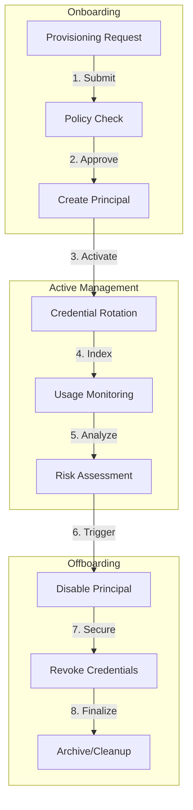

### 2. Credential Rotation Logic Topology
*Visualizing how automated rotation is orchestrated.*
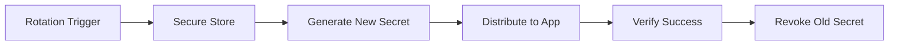

### 3. Identity Risk Scoring Model
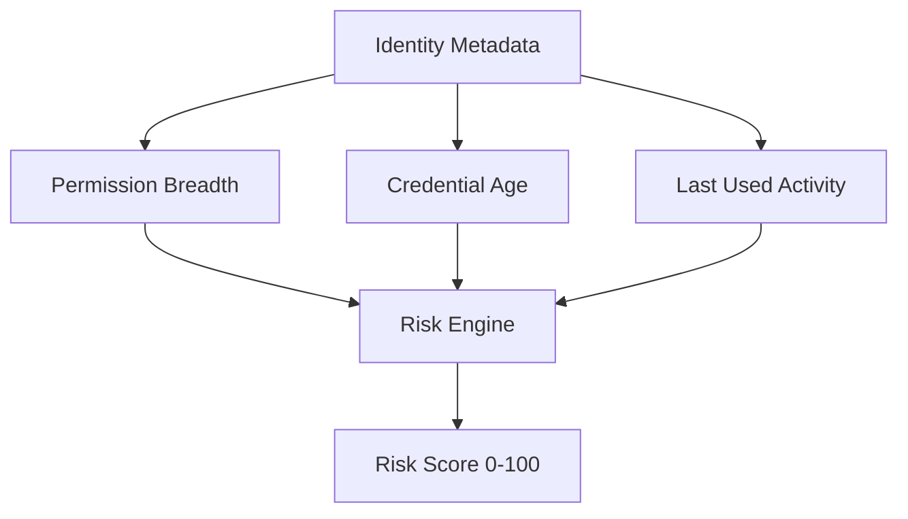

### 4. Identity Hub Architecture
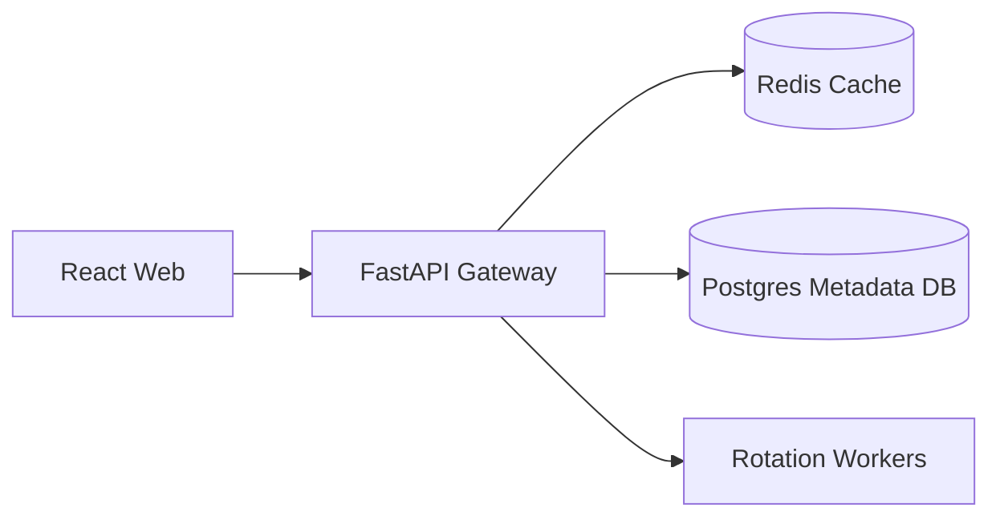

### 5. Deployment Topology: High-Available Identity Hub
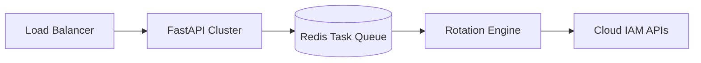

### 6. Access Validation Flow
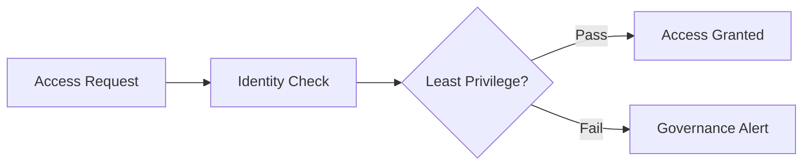

### 7. Foundation: Multi-Environment Setup
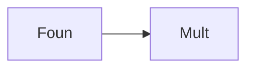

### 8. Networking: Secure Identity Tunnels
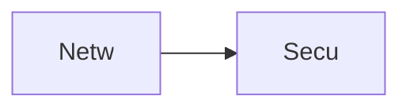

### 9. Component: Provisioning Engine
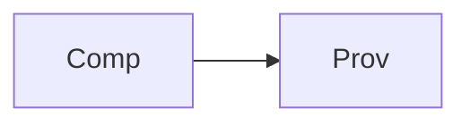

### 10. Component: Rotation Engine
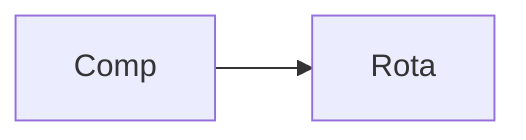

### 11. Component: Risk Engine
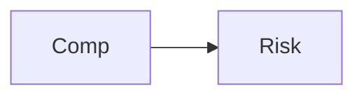

### 12. Component: Decommission Engine
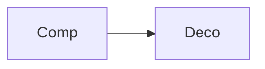

### 13. Logic: Credential Generator
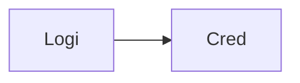

### 14. Logic: Permission Matrix Resolver
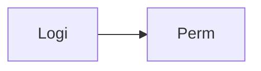

### 15. Logic: Risk Weighting Algorithm
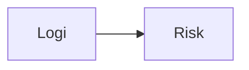

### 16. Logic: Audit Event Broker
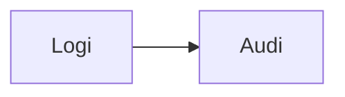

### 17. Architecture: Global Identity Plane
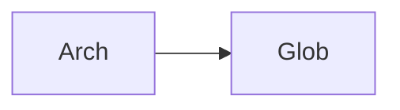

### 18. Architecture: Event-Driven Lifecycle
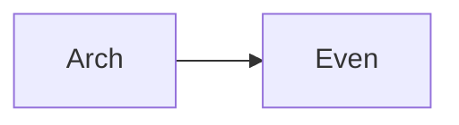

### 19. Architecture: Multi-Cloud IAM Bridge
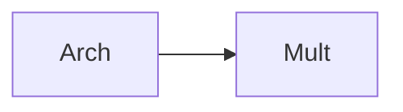

### 20. Pattern: Identity-as-Code
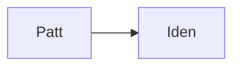

### 21. Pattern: Automated Secret Rotation
```mermaid
graph LR
    P[Patt] --> A[Auto]
```

### 22. Pattern: Zero-Trust Identity
```mermaid
graph LR
    P[Patt] --> Z[Zero]
```

### 23. Security: Signed Principal Claims
```mermaid
graph LR
    S[Secu] --> S[Sign]
```

### 24. Security: Least Privilege Enforcement
```mermaid
graph LR
    S[Secu] --> L[Leas]
```

### 25. Security: Secure Audit Record
```mermaid
graph LR
    S[Secu] --> S[Secu]
```

### 26. Feature: Principal Usage Heatmap
```mermaid
graph LR
    F[Feat] --> P[Prin]
```

### 27. Feature: Rotation Health Dashboard
```mermaid
graph LR
    F[Feat] --> R[Rota]
```

### 28. Feature: Auto-generated Identity Report
```mermaid
graph LR
    F[Feat] --> A[Auto]
```

### 29. Compliance: SOC2 IAM Controls
```mermaid
graph LR
    C[Comp] --> S[SOC2]
```

### 30. Compliance: GDPR Data Access Mapping
```mermaid
graph LR
    C[Comp] --> G[GDPR]
```

### 31. Infrastructure: Redis Rotation Queue
```mermaid
graph LR
    I[Infr] --> R[Redi]
```

### 32. Infrastructure: Postgres Principal DB
```mermaid
graph LR
    I[Infr] --> P[Post]
```

### 33. Deployment: Kubernetes Identity Pods
```mermaid
graph LR
    D[Depl] --> K[Kube]
```

### 34. Deployment: Multi-Region Identity Sync
```mermaid
graph LR
    D[Depl] --> M[Mult]
```

### 35. Monitoring: Rotation Success Rate KPI
```mermaid
graph LR
    M[Moni] --> R[Rota]
```

### 36. Monitoring: Principal Sprawl Analytics
```mermaid
graph LR
    M[Moni] --> P[Prin]
```

### 37. UI: Identity Hub View
```mermaid
graph LR
    U[UI] --> I[Iden]
```

### 38. UI: Credential Management Pane
```mermaid
graph LR
    U[UI] --> C[Cred]
```

### 39. UI: Risk Distribution Graph
```mermaid
graph LR
    U[UI] --> R[Risk]
```

### 40. UI: Governance Workflow Dashboard
```mermaid
graph LR
    U[UI] --> G[Gove]
```

### 41. CI/CD: Principal config validation
```mermaid
graph LR
    C[CICD] --> P[Prin]
```

### 42. CI/CD: Rotation test pipeline
```mermaid
graph LR
    C[CICD] --> R[Rota]
```

### 43. Strategy: Identity Minimization
```mermaid
graph LR
    S[Stra] --> I[Iden]
```

### 44. Strategy: Automation-First IAM
```mermaid
graph LR
    S[Stra] --> A[Auto]
```

### 45. Feature: Multi-Cloud Account Factory
```mermaid
graph LR
    F[Feat] --> M[Mult]
```

### 46. Feature: Stale Principal Detector
```mermaid
graph LR
    F[Feat] --> S[Stal]
```

### 47. Feature: Governance Scorecard
```mermaid
graph LR
    F[Feat] --> G[Gove]
```

### 48. Logic: Credential Versioning Solver
```mermaid
graph LR
    L[Logi] --> C[Cred]
```

### 49. Data Model: Principal Entity
```mermaid
graph LR
    D[Data] --> P[Prin]
```

### 50. Enterprise Identity Excellence
```mermaid
graph LR
    E[Entr] --> I[Iden]
```

---

## 🛠️ Technical Stack & Implementation

### Identity Engine & APIs
- **Framework**: Python 3.11+ / FastAPI.
- **Provisioning Engine**: Standardized creation logic with metadata enforcement.
- **Credential Manager**: Simulated secret generation and versioned management.
- **Rotation Engine**: Time-based worker for automated credential refresh.
- **Risk Engine**: Multi-factor scoring model for identity audit.
- **Cache**: Redis for high-speed identity indexing and rotation task queuing.
- **Persistence**: PostgreSQL for principal metadata, credential histories, and audit trails.
- **Identity**: OIDC / JWT with RBAC for granular lifecycle management access.

### Frontend (Identity Dashboard)
- **Framework**: React 18 / Vite.
- **Theme**: Sky / Slate (Modern Cloud Security & Identity aesthetic).
- **Visualization**: Recharts for lifecycle velocity and risk distribution graphs.

### Infrastructure
- **Runtime**: AWS EKS (Kubernetes).
- **Deployment**: Helm charts for engine clusters and rotation workers.
- **IaC**: Terraform (Modular with Identity focus).

---

## 🚀 Deployment Guide

### Local Development
```bash
# Clone the repository
git clone https://github.com/devopstrio/service-principal-lifecycle.git
cd service-principal-lifecycle

# Setup environment
cp .env.example .env

# Launch the Identity stack (API, Workers, DB, Redis, UI)
make up

# Run a sample identity lifecycle simulation
make rotate-credentials

# Run an identity risk audit
make audit-principals
```
Access the Service Principal Hub at `http://localhost:3000`.

---

## 📜 License
Distributed under the MIT License. See `LICENSE` for more information.
