<div align="center">


<h1>Service Principal Lifecycle Platform</h1>

<p><strong>The Strategic Governance Control Plane for Provisioning, Rotating, and Retiring Cloud Identities at Enterprise Scale.</strong></p>

[]()
[]()
[]()

<br/>

> **"Identity is the new perimeter."** 
> **Service Principal Lifecycle (Identity-Ops)** is an institutional-grade platform designed to provide a secure, measurable, and highly automated foundation for global service identity governance. It orchestrates the entire lifecycle—from standardized provisioning and least-privilege assignment to automated credential rotation and risk-based decommissioning.

</div>

---

## 🏛️ Executive Summary

Modern cloud architectures rely on thousands of non-human identities. Organizations often fail to maintain security not because of a lack of credentials, but because of fragmented identity lifecycles and unmanaged credential rotation that creates significant security blind spots.

This platform provides the **Identity Governance Plane**. It implements a complete **Identity Intelligence Framework**, enabling IAM and Security teams to manage service principals as a first-class citizen. By automating the rotation of secrets and certificates and enforcing least-privilege boundaries, we ensure that every workload identity is continuously secured, governed, and ready for institutional audits with strategic precision.

---

## 📐 Architecture Storytelling: Principal Reference Models

### 1. Principal Architecture: Global Service Principal Lifecycle & Governance Plane
This diagram illustrates the end-to-end flow from initial identity request and automated provisioning to cryptographic secret rotation and forensic auditing.

```mermaid
graph LR
    %% Subgraph Definitions
    subgraph IdentityRequest["Identity Request Hub"]
        direction TB
        Portal["Self-Service Identity Portal"]
        ApiRequest["API-Driven Identity Request"]
        Approval["Manager / Security Approval"]
    end

    subgraph GovernanceEngine["Identity Intelligence Hub"]
        direction TB
        API["FastAPI Governance Gateway"]
        RBAC["RBAC & Permission Manager"]
        Risk["Identity Risk Scorer"]
        Inventory["Principal Metadata Inventory"]
    end

    subgraph LifecycleAutomation["Lifecycle Automation Engine"]
        direction TB
        Provisioner["Standardized SP Provisioner"]
        Rotator["Automated Credential Rotator"]
        Decom["Decommissioning Workflow"]
    end

    subgraph IdentityPlane["Enterprise Identity Plane"]
        direction TB
        Entra["Microsoft Entra ID / Azure AD"]
        AWS["AWS IAM / Identity Center"]
        Vault["Secret Vault (HashiCorp/KMS)"]
    end

    subgraph Operations["Governance & Forensic Audit"]
        direction TB
        Dash["Identity Posture Dashboard"]
        Compliance["Compliance & Expiry Auditor"]
        Forensics["Identity Metadata Lake"]
    end

    %% Flow Arrows
    IdentityRequest -->|1. Request Identity| API
    API -->|2. Validate Policy| RBAC
    RBAC -->|3. Approve Permissions| Provisioner
    Provisioner -->|4. Create Service Principal| IdentityPlane
    
    IdentityPlane -->|5. Sync Metadata| Inventory
    Inventory -->|6. Calculate Risk| Risk
    Risk -->|7. Trigger Rotation| Rotator
    Rotator -->|8. Update Secrets| IdentityPlane
    
    IdentityPlane -->|9. Audit Logs| Dash
    Dash -->|10. Monitor Expiry| Compliance
    Compliance -->|11. Trigger Cleanup| Decom
    Decom -->|12. Retire Identity| IdentityPlane
    API -->|Forensic Data| Forensics

    %% Styling
    classDef request fill:#f5f5f5,stroke:#616161,stroke-width:2px;
    classDef intel fill:#ede7f6,stroke:#311b92,stroke-width:2px;
    classDef automation fill:#e3f2fd,stroke:#0d47a1,stroke-width:2px;
    classDef identity fill:#e8f5e9,stroke:#1b5e20,stroke-width:2px;
    classDef ops fill:#fce4ec,stroke:#880e4f,stroke-width:2px;

    class IdentityRequest request;
    class GovernanceEngine intel;
    class LifecycleAutomation automation;
    class IdentityPlane identity;
    class Operations ops;
```

### 2. The Identity Lifecycle Management Flow
The continuous path of a service principal from birth to secure decommissioning.

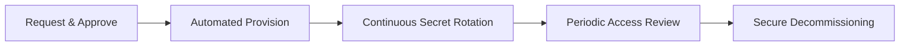

### 3. Automated Credential Rotation Engine
Visualizing the high-integrity process for rotating secrets without application downtime.

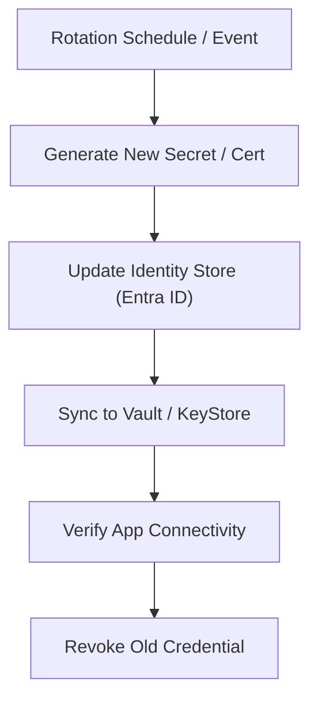

### 4. Certificate-Based Authentication (CBA) Topology
Implementing high-security workload identities using private CAs and certificate mapping.

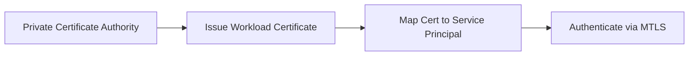

### 5. Multi-Tenant Identity Isolation Model
Standardizing how service principals are segregated across complex business unit structures.

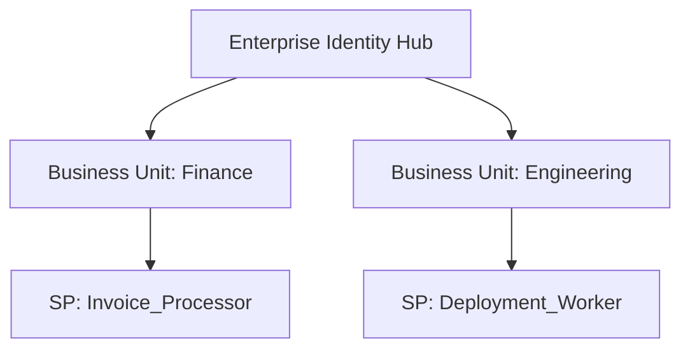

### 6. Permission & RBAC Governance Loop
The strategic process of rightsizing workload permissions to achieve Zero-Trust.

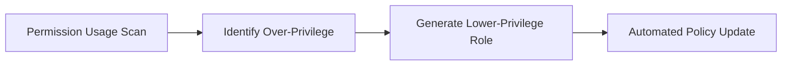

### 7. Service Principal Inventory & Metadata Hub
Managing the "who, what, and why" for every automated identity in the cloud.

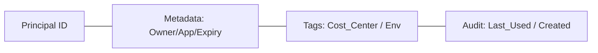

### 8. Workload Identity Security Guardrails
Enforcing conditional access and location-based policies for non-human identities.

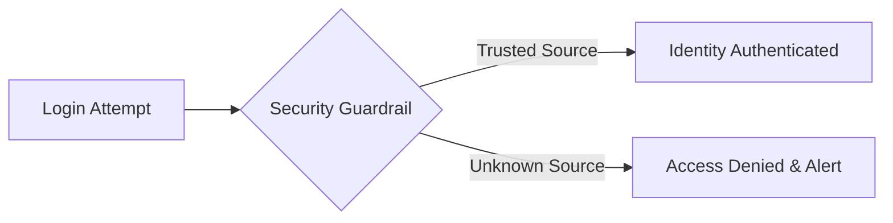

### 9. Compliance & Expiry Monitoring Hub
Proactive alerting and automated pruning of stale or expiring workload identities.

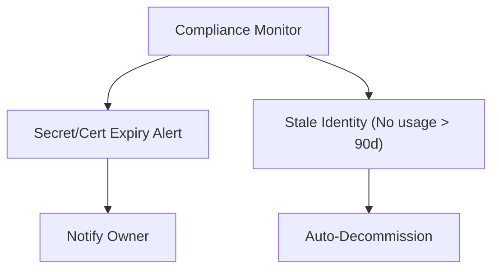

### 10. IaC Identity Deployment: Terraform for Identities
Version-controlling app registrations and service principals as first-class infrastructure code.

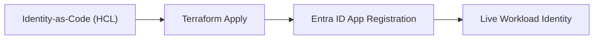

### 11. Metadata Lake for Identity Forensics
Storing immutable records of credential changes and identity usage for security investigations.

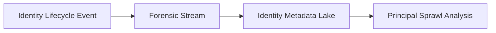

---

## 🏛️ Core Identity Pillars

1.  **Automated Provisioning Engine**: Centralized hub for creating service principals with standardized naming, tagging, and isolation.
2.  **Dynamic Credential Rotation**: Automated lifecycle management for client secrets and certificates to reduce exposure windows.
3.  **Least-Privilege Enforcement**: Policy-driven assessment of permissions to ensure identities only have the required access.
4.  **Identity Risk Scoring**: Continuous evaluation of principal risk based on permission breadth, age, and usage patterns.
5.  **Usage & Activity Monitoring**: Real-time tracking of identity usage to detect anomalies and identify stale principals.
6.  **Immutable Governance Audit**: Comprehensive logging of every identity lifecycle event from creation to retirement.

---

## 🛠️ Technical Stack & Implementation

### Identity Engine & APIs
*   **Framework**: Python 3.11+ / FastAPI.
*   **Provisioning Engine**: Standardized creation logic for Entra ID (Azure AD) and AWS IAM.
*   **Rotation Engine**: Multi-threaded workers for secret and certificate lifecycle management.
*   **Risk Engine**: Strategic scoring model for identifying high-risk or stale identities.
*   **State Management**: PostgreSQL (Metadata) and Redis (Rotation Task Cache).

### Identity Dashboard (UI)
*   **Framework**: React 18 / Vite.
*   **Theme**: Sky / Slate (Modern Cloud Security & Identity aesthetic).
*   **Visualization**: Recharts for lifecycle velocity and risk distribution graphs.

### Infrastructure & DevOps
*   **Runtime**: AWS EKS or Azure Kubernetes Service (AKS).
*   **IaC**: Modular Terraform for deploying the identity hub and lifecycle workers.

---

## 🏗️ IaC Mapping (Module Structure)

| Module | Purpose | Real Services |
| :--- | :--- | :--- |
| **`infrastructure/governance`** | Central management plane | EKS, PostgreSQL, Redis |
| **`infrastructure/identities`** | Cloud-native identity connectors | Entra ID, AWS IAM, GCP IAM |
| **`infrastructure/secrets`** | Credential rotation and storage | Key Vault, KMS, HashiCorp Vault |
| **`infrastructure/auditing`** | Forensic logging and monitoring | Log Analytics, CloudWatch |

---

## 🚀 Deployment Guide

### Local Principal Environment
```bash
# Clone the identity platform
git clone https://github.com/devopstrio/service-principal-lifecycle.git
cd service-principal-lifecycle

# Configure environment
cp .env.example .env

# Launch the Identity stack
make up

# Run an automated credential rotation simulation
make rotate-credentials

# Run an identity risk audit
make audit-principals
```

Access the Service Principal Hub at `http://localhost:3000`.

---

## 📜 License
Distributed under the MIT License. See `LICENSE` for more information.

---
<div align="center">
  <p>© 2026 Devopstrio. All rights reserved.</p>
</div>
